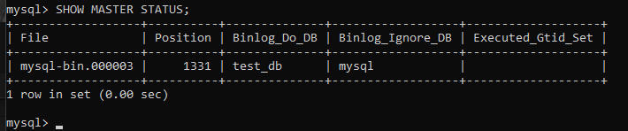
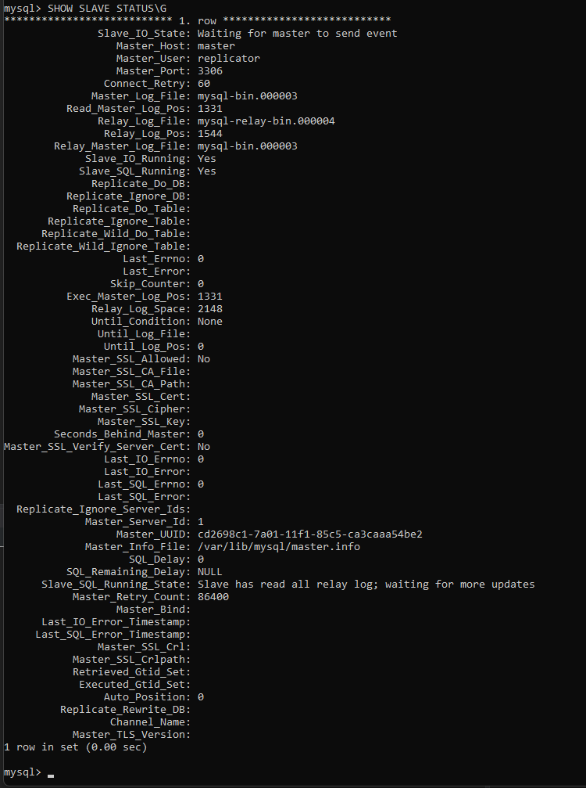
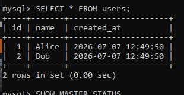
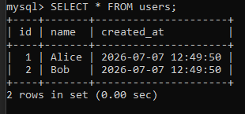
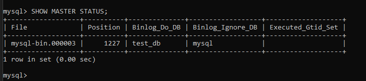
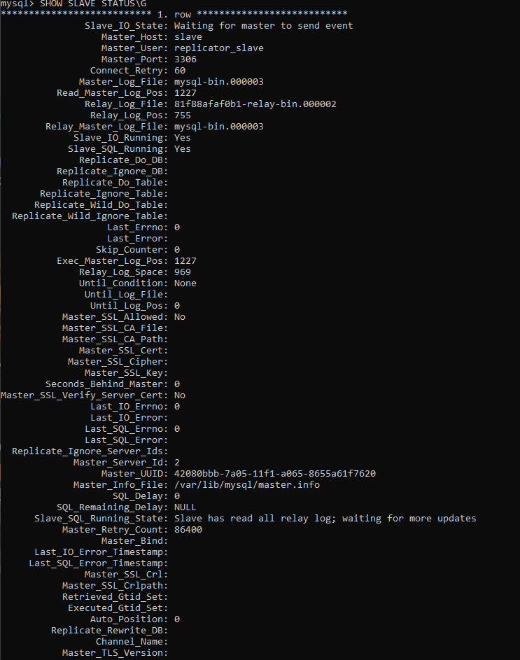
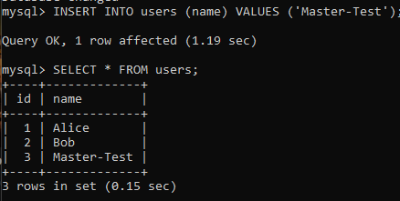
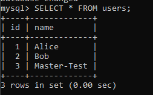
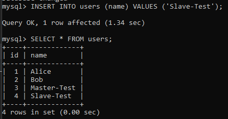
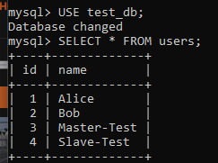

# Домашнее задание к занятию «Репликация и масштабирование. Часть 1»
---

### Задание 1

На лекции рассматривались режимы репликации master-slave, master-master, опишите их различия.

Ответить в свободной форме.

---

### Задание 2

Выполните конфигурацию master-slave репликации, примером можно пользоваться из лекции.

Приложите скриншоты конфигурации, выполнения работы: состояния и режимы работы серверов.

Дополнительные задания (со звёздочкой*)
Эти задания дополнительные, то есть не обязательные к выполнению, и никак не повлияют на получение вами зачёта по этому домашнему заданию. Вы можете их выполнить, если хотите глубже шире разобраться в материале.

---

### Задание 3*

Выполните конфигурацию master-master репликации. Произведите проверку.

Приложите скриншоты конфигурации, выполнения работы: состояния и режимы работы серверов.

---

<h2 align="center">Решение</h2>

---

### Задание 1. Различия между режимами репликации master-slave и master-master

Основное различие между этими двумя режимами — в направлении потока данных и ролях серверов

|Характеристики|Master-Slave(ведущий-ведомый)|Master-Master(Ведущий-ведущий)|
|--------------|-----------------------------|------------------------------|
|Направление репликации|Однонаправленная: данные копируются только с одного главного сервера (Master) на один или несколько подчиненных (Slave)|Двунаправленная: каждый сервер является одновременно и Master, и Slave для другого. Данные реплицируются в обе стороны|
|Роль серверов|Роли строго разделены. Master принимает все запросы на запись (INSERT, UPDATE, DELETE). Slave используются только для чтения (SELECT) .|Оба сервера равноправны. Каждый может принимать как запросы на чтение, так и на запись, которые затем реплицируются на другой сервер|
|Основное применение|Масштабирование производительности (распределение нагрузки чтения), создание резервных копий без остановки основного сервера и обеспечение отказоустойчивости в простых сценариях .|Повышение доступности и отказоустойчивости. Если один сервер выходит из строя, второй продолжает работу, принимая запись. Также используется для географического распределения нагрузки.|
|Ключевая сложность|Настройка и управление относительно просты. Основные задачи — мониторинг состояния репликации и разрешение возможных ошибок на Slave-сервере .|Настройка значительно сложнее. Самая большая проблема — разрешение конфликтов при одновременной записи на оба сервера. Требуется тщательно продуманная схема или использование автоматических механизмов разрешения конфликтов (например, на основе auto_increment_increment и auto_increment_offset)|
-----------------------------------------------------------------------------

### Задание 2. Конфигурация Master-Slave репликации

Конфигурация

docker-compose.yml

```yaml
services:
  master:
    image: mysql:5.7
    container_name: mysql-master
    environment:
      MYSQL_ROOT_PASSWORD: root123
    ports:
      - "3307:3306"
    command:
      - --server-id=1
      - --log-bin=mysql-bin
      - --binlog-do-db=test_db
      - --binlog-ignore-db=mysql

  slave:
    image: mysql:5.7
    container_name: mysql-slave
    environment:
      MYSQL_ROOT_PASSWORD: root123
    ports:
      - "3308:3306"
    command:
      - --server-id=2
      - --relay-log=mysql-relay-bin
      - --log-bin=mysql-bin
      - --binlog-do-db=test_db
      - --binlog-ignore-db=mysql
      - --read-only=1
```

Настройка

На мастере

```sql
CREATE USER 'replicator'@'%' IDENTIFIED BY 'repl123';
GRANT REPLICATION SLAVE ON *.* TO 'replicator'@'%';
FLUSH PRIVILEGES;

FLUSH TABLES WITH READ LOCK;
SHOW MASTER STATUS;
```

На слейве

```sql
CHANGE MASTER TO
MASTER_HOST='master',
MASTER_USER='replicator',
MASTER_PASSWORD='repl123',
MASTER_LOG_FILE='mysql-bin.000003',
MASTER_LOG_POS=154;

START SLAVE;
SHOW SLAVE STATUS\G
```









---

### Задание 3 Master-Master

На слейве (для обратной репликации):

```sql
CREATE USER 'replicator_slave'@'%' IDENTIFIED BY 'repl123';
GRANT REPLICATION SLAVE ON *.* TO 'replicator_slave'@'%';
FLUSH PRIVILEGES;

FLUSH TABLES WITH READ LOCK;
SHOW MASTER STATUS;
```

На мастере:

```sql
STOP SLAVE;

CHANGE MASTER TO
MASTER_HOST='slave',
MASTER_USER='replicator_slave',
MASTER_PASSWORD='repl123',
MASTER_LOG_FILE='mysql-bin.000003',
MASTER_LOG_POS=792;

START SLAVE;
SHOW SLAVE STATUS\G
```

### Результаты

Из слейва делаем мастера(окно 2):



Проверяем на мастере статус (окно 1):



Создаем на мастере (окно 1) пользователя:



Проверяем на слейве (окно 2) синхронизацию:



На слейве (окно 2) создаём пользователя:



На мастере (окно 1) проверяем пользователей:



---

<h2 align="center">Вывод</h2>

В ходе выполнения домашнего задания были получены практические навыки:

- Master-Slave — однонаправленная репликация, подходит для распределения нагрузки чтения.
- Master-Master — двунаправленная репликация, обеспечивает высокую доступность.
- Основная сложность master-master — разрешение конфликтов при одновременной записи.

---
